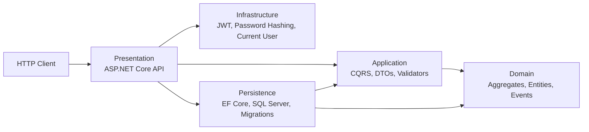
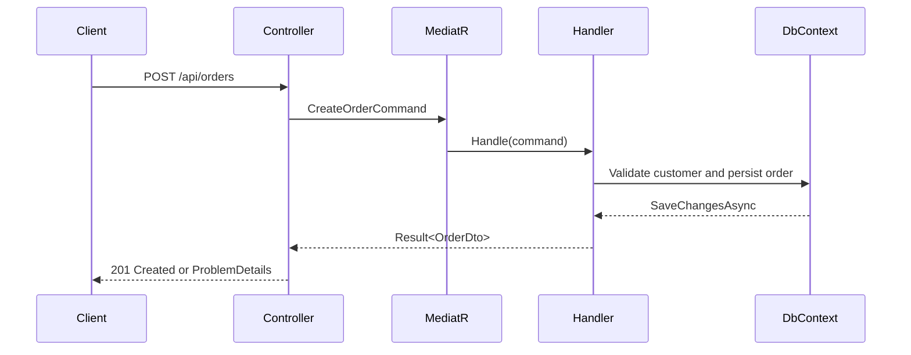
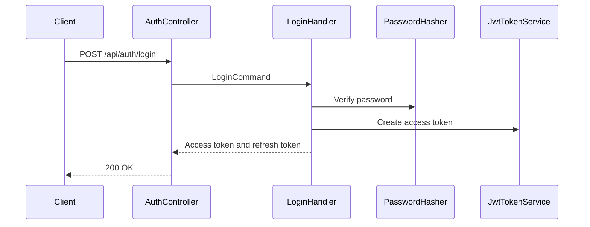

# dotnet-enterprise-template

[](https://github.com/diwb/dotnet-enterprise-template/actions/workflows/ci.yml)
[](https://github.com/diwb/dotnet-enterprise-template/actions/workflows/codeql.yml)
[](https://dotnet.microsoft.com/)
[](docs/ARCHITECTURE.md)
[](LICENSE)

Enterprise-ready ASP.NET Core template using Clean Architecture, DDD, CQRS, EF Core, SQL Server, Docker and GitHub Actions.

This repository is designed to feel like a professional internal platform starter kit: opinionated enough to accelerate delivery, explicit enough to teach architecture, and small enough to adapt without fighting a framework.

## Overview

The template models a B2B commerce API with customers, orders, order items, payments, application users and refresh tokens. It includes auditing, soft delete, pagination, filtering, sorting, validation, JWT authentication, authorization policies, correlation IDs, structured logging, health checks, rate limiting and security headers.

## Features

- Clean Architecture solution boundaries.
- DDD-inspired aggregate roots and value objects.
- CQRS-style MediatR commands and queries.
- FluentValidation command validation.
- EF Core SQL Server persistence and migrations.
- Auditing and soft delete support.
- JWT bearer authentication.
- Role-based authorization policies.
- Refresh-token persistence model.
- PBKDF2 password hashing.
- CORS allowlist and fixed-window rate limiting.
- Global exception handling with RFC 7807 ProblemDetails.
- Serilog request logging and correlation IDs.
- Docker Compose local infrastructure.
- xUnit unit and integration tests.
- GitHub Actions CI, CodeQL, coverage and vulnerability checks.

## Architecture



### CQRS Flow



### Authentication Flow



## Folder Structure

```text
src/
  Domain          Business rules, aggregates, value objects and domain events
  Application     CQRS requests, handlers, DTOs, validators and contracts
  Infrastructure  Security and runtime adapters
  Persistence     EF Core DbContext, configurations, migrations and seed data
  Presentation    ASP.NET Core controllers, middleware and dependency composition
  Shared          Result pattern and pagination primitives
tests/
  UnitTests        Fast domain and service tests
  IntegrationTests API bootstrapping and HTTP behavior tests
docs/              Official architecture, operations and contributor docs
.github/           CI, CodeQL, Dependabot and community templates
```

## Quick Start

Prerequisites:

- .NET SDK 10.0.x
- Docker Desktop or a reachable SQL Server instance
- EF Core CLI tool compatible with .NET 10

```powershell
dotnet restore DotNetEnterpriseTemplate.slnx
dotnet build DotNetEnterpriseTemplate.slnx
docker compose up -d sqlserver
dotnet ef database update --project src\Persistence\Persistence.csproj --startup-project src\Presentation\Presentation.csproj
dotnet run --project src\Presentation\Presentation.csproj
```

Default endpoints:

- HTTP: `http://localhost:5077`
- HTTPS: `https://localhost:7168`
- Swagger UI: `/swagger`
- Health: `/health`

Seeded local administrator:

- Email: `admin@enterprise.local`
- Password: `Admin123!`

Use this account for local development only.

## Docker

```powershell
docker compose up --build
```

The compose file starts SQL Server and the API on port `8080`.

## Database And Migrations

Default local connection string:

```text
Server=localhost,1433;Database=DotNetEnterpriseTemplate;User Id=sa;Password=Your_strong_password123;TrustServerCertificate=True
```

Apply migrations:

```powershell
dotnet ef database update --project src\Persistence\Persistence.csproj --startup-project src\Presentation\Presentation.csproj
```

Create a migration:

```powershell
dotnet ef migrations add MigrationName --project src\Persistence\Persistence.csproj --startup-project src\Presentation\Presentation.csproj --output-dir Migrations
```

## API Examples

Login:

```http
POST /api/auth/login
Content-Type: application/json

{
  "email": "admin@enterprise.local",
  "password": "Admin123!"
}
```

Create a customer:

```http
POST /api/customers
Authorization: Bearer {accessToken}
Content-Type: application/json

{
  "legalName": "Contoso Retail Ltd.",
  "document": "12.345.678/0001-90",
  "email": "billing@contoso.example",
  "billingAddress": {
    "street": "Av. Paulista",
    "number": "1000",
    "district": "Bela Vista",
    "city": "Sao Paulo",
    "state": "SP",
    "postalCode": "01310-100",
    "country": "Brazil"
  }
}
```

Create an order:

```http
POST /api/orders
Authorization: Bearer {accessToken}
Content-Type: application/json

{
  "customerId": "{customerId}",
  "items": [
    {
      "sku": "SUPPORT-ENTERPRISE",
      "description": "Enterprise support plan",
      "quantity": 2,
      "unitPrice": 1500
    }
  ]
}
```

## Development Workflow

```powershell
dotnet restore DotNetEnterpriseTemplate.slnx
dotnet format DotNetEnterpriseTemplate.slnx --verify-no-changes
dotnet build DotNetEnterpriseTemplate.slnx --configuration Release --no-restore
dotnet test DotNetEnterpriseTemplate.slnx --configuration Release --no-build
dotnet list DotNetEnterpriseTemplate.slnx package --vulnerable --include-transitive
```

Use semantic commits: `feat:`, `fix:`, `refactor:`, `docs:`, `test:`, `build:` and `chore:`.

## Documentation

- [Architecture](docs/ARCHITECTURE.md)
- [CQRS](docs/CQRS.md)
- [DDD](docs/DDD.md)
- [Security](docs/SECURITY.md)
- [Logging](docs/LOGGING.md)
- [Testing](docs/TESTING.md)
- [Docker](docs/DOCKER.md)
- [Deployment](docs/DEPLOYMENT.md)
- [Dependencies](docs/DEPENDENCIES.md)
- [Troubleshooting](docs/TROUBLESHOOTING.md)
- [Audit Report](docs/AUDIT_REPORT.md)
- [Final Audit](docs/FINAL_AUDIT.md)

## Roadmap

- v1: enterprise template baseline, docs, CI, security controls and contribution readiness.
- v2: refresh-token rotation endpoints, richer order lifecycle, SQL Server Testcontainers and OpenTelemetry.
- v3: template packaging, multi-tenant sample module, deployment blueprints and reference dashboards.

## Troubleshooting

See [docs/TROUBLESHOOTING.md](docs/TROUBLESHOOTING.md) for SQL Server, EF tooling, Docker and local certificate guidance.

## FAQ

See [docs/FAQ.md](docs/FAQ.md).

## License

MIT. See [LICENSE](LICENSE).
