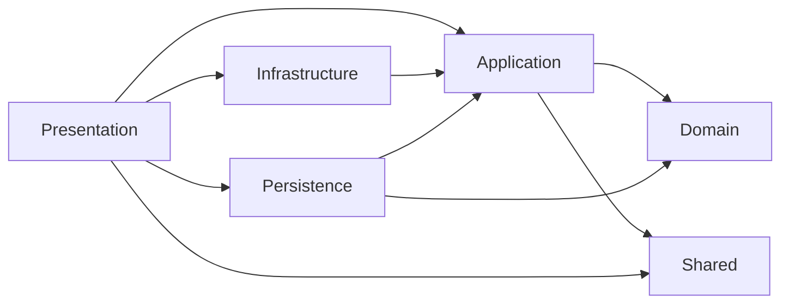
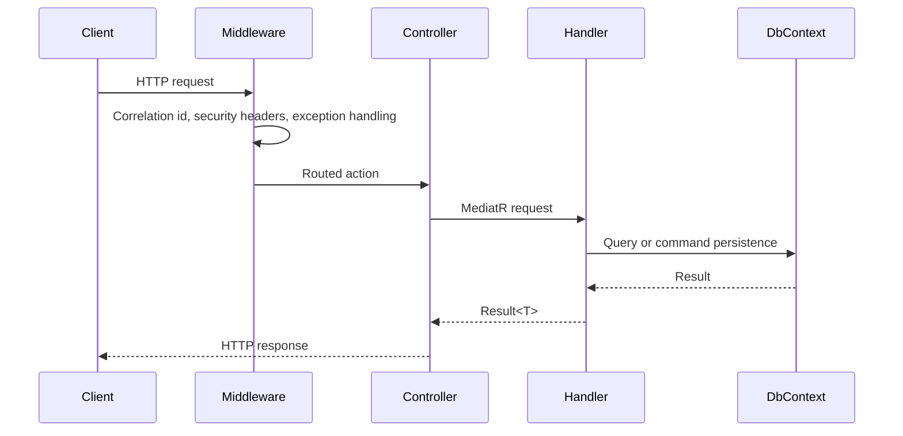

# Architecture

This repository implements Clean Architecture for an enterprise ASP.NET Core Web API. The design goal is to keep business rules independent, make application use cases explicit and isolate infrastructure details behind composition and contracts.

## Dependency Rule

The Domain layer does not reference ASP.NET Core, EF Core, MediatR or infrastructure concerns.

## Layers

| Layer | Responsibility | Examples |
| --- | --- | --- |
| Domain | Enterprise rules and invariants | `Order`, `Customer`, `Payment`, domain events |
| Application | Use cases and orchestration | Commands, queries, handlers, validators, DTOs |
| Infrastructure | Runtime adapters | JWT token generation, password hashing, current user |
| Persistence | Data access | EF Core DbContext, mappings, migrations, seed |
| Presentation | HTTP boundary | Controllers, middleware, auth, CORS, rate limiting |
| Shared | Cross-cutting primitives | Result pattern, pagination |

## Request Flow

## Domain Model

The sample domain represents B2B commerce:

- Customers with billing addresses.
- Orders with items and lifecycle state.
- Payments with status.
- Application users with roles and refresh tokens.

The domain supports soft delete and audit metadata through `AuditableEntity`.

## Architectural Tradeoffs

Application references EF Core abstractions to support efficient query composition. This is an intentional pragmatic choice. Persistence still owns DbContext implementation, mappings, migrations and provider configuration.

Repository and specification abstractions are intentionally deferred until query complexity requires them.
