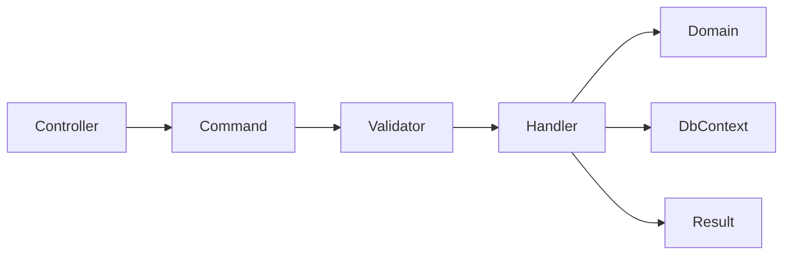
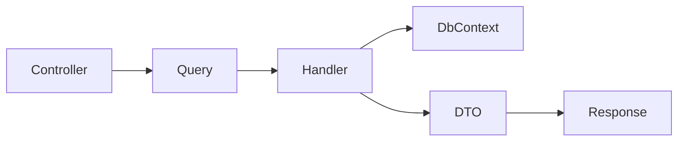

# CQRS

The Application layer uses CQRS-style requests through MediatR. Commands change state. Queries read state. Each use case has an explicit request, handler and response contract.

## Command Flow

## Query Flow

## Current Requests

| Request | Type | Purpose |
| --- | --- | --- |
| `CreateCustomerCommand` | Command | Creates a customer with billing address |
| `GetCustomersQuery` | Query | Lists customers with pagination, search and sorting |
| `CreateOrderCommand` | Command | Creates and submits an order for an existing customer |
| `LoginCommand` | Command | Authenticates a user and issues tokens |

## Guidelines

- Keep handlers focused on one use case.
- Use validators for request shape and simple input rules.
- Put business invariants in domain entities.
- Return `Result<T>` for expected failures.
- Use exceptions for unexpected failures only.
